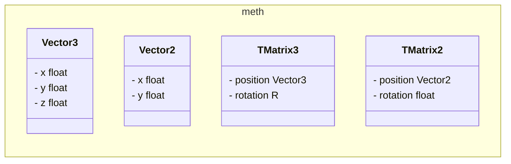
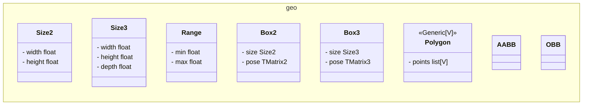

# math/geo 클래스 구조





---

## 클래스별 사용 예제

### Vector3

```python
# 생성
v = Vector3(1.0, 2.0, 3.0)

v = Vector3.from_xyz(1.0, 2.0, 3.0)

v = Vector3.zero()

v = Vector3.from_array([1.0, 2.0, 3.0])

# 자주 쓰는 메서드
length: float = v.length()

normalized: Vector3 = v.normalized()

dist: float = v.distance_to(other)

dot: float = v.dot(other)

cross: Vector3 = v.cross(other)           # 외적 (Vector3 전용)

lerped: Vector3 = v.lerp(other, t=0.5)
```

### TMatrix3

```python
# 생성
m: TMatrix3 = TMatrix3.identity()

m: TMatrix3 = TMatrix3.from_euler_xyz(rx, ry, rz, position=Vector3(1, 0, 0))

m: TMatrix3 = TMatrix3.from_euler_zyx(rz, ry, rx)

m: TMatrix3 = TMatrix3.from_quaternion([qx, qy, qz, qw])

m: TMatrix3 = TMatrix3.from_4by4_row_major([[r00, r01, r02, tx], ...])

# 자주 쓰는 메서드
m2: TMatrix3 = m @ other                               # 곱셈, 변환 

inv: TMatrix3 = m.inverse()                            # 역변환

translated: TMatrix3 = m.translate_local(Vector3(0, 0, 1))   # 로컬 좌표계 기준 이동

translated: TMatrix3 = m.translate_world(Vector3(0, 0, 1))   # 월드 좌표계 기준 이동

rotated: TMatrix3 = m.rotate_z_local(math.pi / 2)     # 로컬 Z축 회전

rotated: TMatrix3 = m.rotate_z_world(math.pi / 2)     # 월드 Z축 회전

pts: list[Vector3] = m.transform_points([v1, v2])     # 여러 점 일괄 변환

euler: list[float] = m.to_euler_xyz()                 # [rx, ry, rz]

quat: list[float] = m.to_quaternion()                 # [qx, qy, qz, qw]
```

### Size2 / Size3

```python
# 생성
s2: Size2 = Size2(width=3.0, height=4.0)

s3: Size3 = Size3(width=3.0, height=4.0, depth=5.0)

# 자주 쓰는 메서드
area: float = s2.area()                # 넓이

vol: float = s3.volume()               # 부피

scaled: Size2 = s2.scale(2.0)          # 배율 조정 (새 객체)

s2.set_size(5.0, 6.0)                  # 값 변경 (반환 없음)
```

### Range

```python
# 생성
min_max: Range = Range(-math.pi, math.pi)

# 자주 쓰는 메서드
ok: bool = min_max.is_contain(value)       # value가 범위 안에 있는지

clamped: float = min_max.clamp(value)      # 범위 밖이면 경계값으로 클램프

mid: float = min_max.lerp(t=0.5)          # 범위 내 t 위치 값

norm: float = min_max.normalize(value)     # value를 [0, 1]로 정규화

span: float = min_max.span()               # max - min
```

### Box2

```python
# 생성
roi_2d: Box2 = Box2(width=2.0, height=1.0, center=Vector2(0, 0))

roi_2d: Box2 = Box2.from_corners([Vector2(0,0), Vector2(2,0), Vector2(2,1), Vector2(0,1)])

# 자주 쓰는 메서드
corners: list[list[float]] = box.to_corners()

ok: bool = box.is_close(other, thereshold_size=0.01, threshold_position=0.01)
```

### Box3

```python
# 생성
roi_3d: Box3 = Box3(width=2.0, length=3.0, height=1.0, pose=TMatrix3.identity())

box = Box3.from_corners([Vector3(...), ...])

# 자주 쓰는 메서드
ok: bool = box.is_close_size(other, thereshold_size=0.01)

ok: bool = box.is_close_position(other, threshold_position=0.01)
```

### Polygon

```python
# 생성 (Vector2 또는 Vector3 사용 가능)
poly: Polygon2 = Polygon([Vector2(0,0), Vector2(1,0), Vector2(1,1), Vector2(0,1)])

# 자주 쓰는 메서드
center: Vector2 = poly.get_center()             # 무게중심

perimeter: float = poly.perimeter               # 둘레 (property)

count: int = len(poly)                          # 꼭짓점 수

for v in poly: ...                              # iterable
```
