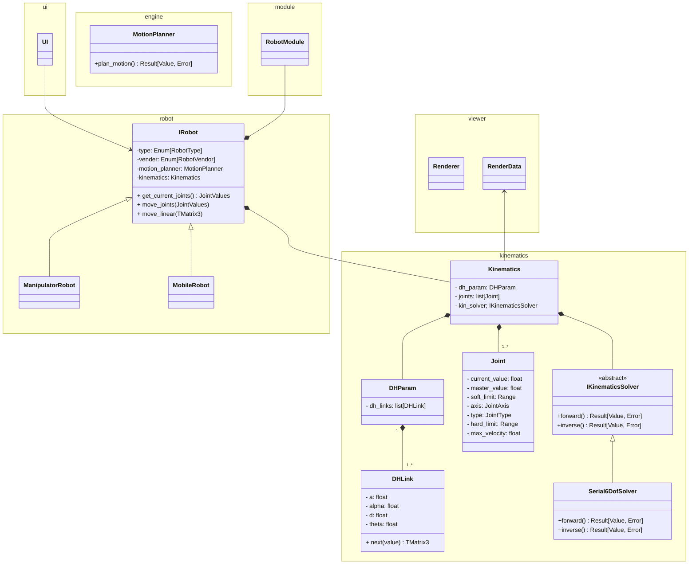

# kinematics 클래스 구조

## 클래스 다이어그램

## 설명

### kinematics 패키지

| 클래스 | 역할 |
|--------|------|
| `DHParam` | Modified D-H 파라미터 정보 (`DHLink`의 집합) 및 link set의 chain rule을 이용한 변환행렬 계산 |
| `Joint` | 액추에이터 Spec 및 상태 정보(현재값, soft/hard limit, 속도 제한) |
| `Kinematics` | `DHParam` + `Joint`, 기구학적 상태 정보 및 하드웨어의 Spec 정보 |
| `IKinematicsSolver` | FK/IK Solver Interface class, kinematics type 별로 solve 방식이 다름 |
| `MotionPlanner` | 속도 프로파일링을 통한 로봇의 경로(매 시간별 각 Joint 들의 값 계산) 계획 (미구현) |

### robot 패키지

| 클래스 | 역할 |
|--------|------|
| `IRobot` | 로봇 베이스 클래스. `Kinematics` 인스턴스 보유 |
| `ManipulatorRobot` | 매니퓰레이터 구현체. DHParam + Joint 리스트로 직접 구성 |

## Mode Definition

- Create Mode: 작업자가 workcell를 구성하고, workflow(작업의 한 사이클 및 loop)를 만드는 Mode. 
- Simulation Mode: 작업자가 만든 workcell의 workflow를 자동으로 돌려보는 Mode.
- Operation Mode: Robot Module을 통해서 workflow를 실행시키고 관망하는 Mode.

### Mode 별 robot data 수정 권한 
|  Mode | User | Comm | Engine | 
|---|---|---|---|
|Creation Mode|Ok|No|Sometimes|
|Simulation Mode|No|No|Ok|
|Operation Mode|No|Ok|No|

### 시뮬레이션에서 작업하는 상황

### 작업한 대로 시뮬레이션 엔진을 이용해 시뮬레이션 하는 상황

### 사용자 인풋 없이 Module 통신을 하면서 렌더링하는 상황